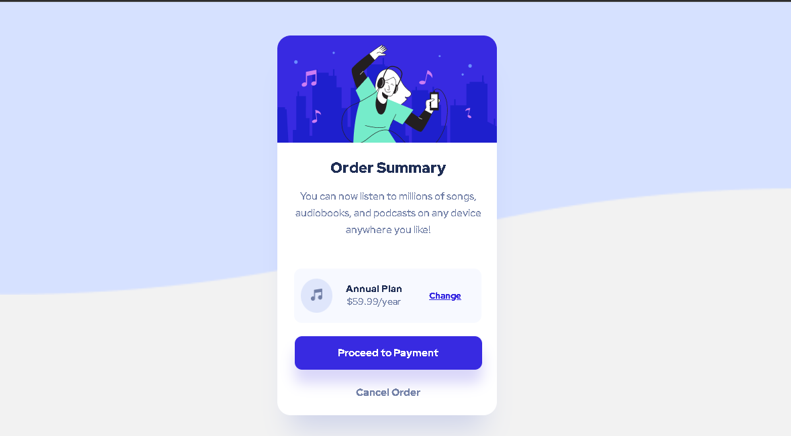
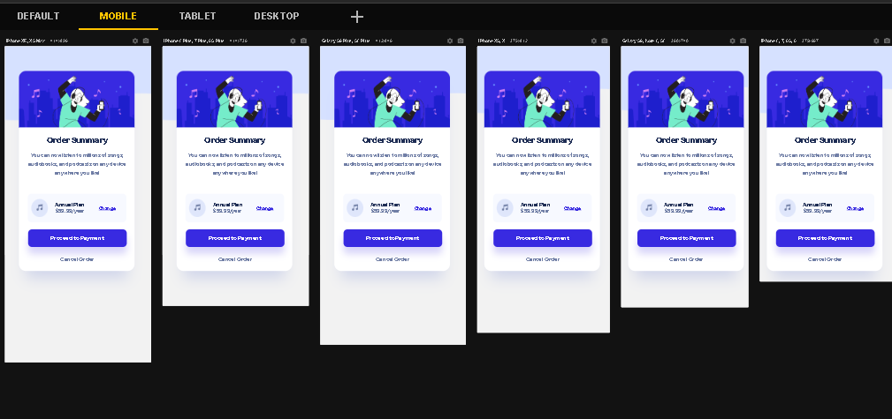

## Table of contents

- [Overview](#overview)
  - The challenge is to build out this page and get it looking as close to the design as possible.

- My process: It took me 3 days to build this.
    - Built with: HTML5 and CSS3.
    - Author: Natali Marinho. 
    - Acknowledgments: javascript, css and html.

### The challenge

Users should be able to:

- View the optimal layout for the app depending on their device's screen size
- See active states for the buttons

### Screenshot

### Built with

- Semantic HTML5 markup
- CSS custom properties
- Flexbox
- Mobile-first workflow

## Author
- Frontend Mentor - [@natsmarinho](https://www.frontendmentor.io/profile/natsmarinho)
- Twitter - [@natsmarinho](https://www.twitter.com/natsmarinho)
- Instagram - [@natsmarinho](https://www.instagram.com/natsmarinho/)
- Linkedin - [@natsmarinho](https://www.linkedin.com/in/natsmarinho)

## Acknowledgments

I would  like to thank for my mentor, Carlos Henrique.